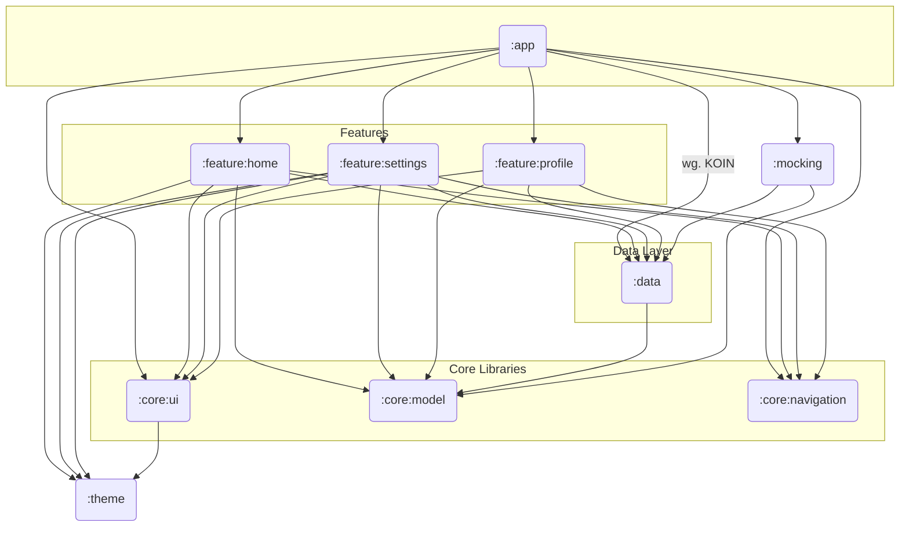

## 1. Das :app Modul (Anwendungsmodul)

Dies ist das Einstiegsmodul deiner Anwendung, das am Ende die APK- oder AAB-Datei erzeugt.

* **Zweck:** Dieses Modul sollte so schlank wie möglich sein. Es hat die Hauptaufgabe, alle anderen Module (insbesondere die Feature-Module) miteinander zu verbinden und die grundlegende App-Konfiguration wie den Application-Graphen für die Dependency Injection (Coin) zu initialisieren.
* **Inhalt:**
  * Die MainActivity, die als Host für deine Jetpack Compose Navigation dient.
  * Initialisierung von globalen Diensten und Bibliotheken (z. B. Coin, Timber).
  * Navigation-Graph, der die verschiedenen Feature-Module miteinander verknüpft.
* **Abhängigkeiten:** Es hängt von allen :feature:* Modulen sowie vom :core:ui und :core:navigation Modul ab.

## 2. Feature-Module (:feature:*)

Jedes Feature deiner App, das eine mehr oder weniger abgeschlossene Funktionalität darstellt, bekommt sein eigenes Modul.

* **Zweck:** Kapselung einer bestimmten Funktion der App, wie z. B. :feature:home, :feature:settings oder :feature:profile. Diese Module sind unabhängig voneinander und sollten sich gegenseitig nicht kennen. Die Kommunikation zwischen ihnen erfolgt über das Navigationsmodul.
* **Inhalt:**
  * UI: Composable-Funktionen, Screens und zugehörige ViewModels für dieses spezielle Feature.
  * Logik: Alle spezifischen Geschäftsregeln, die nur in diesem Feature benötigt werden.
  * Dependency Injection: Ein eigenes Coin-Modul, das die Abhängigkeiten für dieses Feature bereitstellt.
* **Beispiele:**
  * :feature:login
  * :feature:dashboard
  * :feature:product_detail
* **Abhängigkeiten:** Jedes Feature-Modul hängt typischerweise von einem oder mehreren :core:* und :data Modulen ab.

## 3. Core-Module (:core:*)

Diese Module enthalten Code, der von vielen oder allen Feature-Modulen gemeinsam genutzt wird. Sie sollten keine spezifische Feature-Logik enthalten.

* Zweck: Wiederverwendbarkeit von Code maximieren und eine konsistente User Experience sicherstellen.
* Beispiele für Core-Module:
  * :core:ui: Enthält wiederverwendbare UI-Komponenten, dein Material3-Theme, Farben, Typografie und allgemeine Composable-Helfer.
  * :core:model: Definiert die Datenmodelle (z. B. User, Product), die in der gesamten App verwendet werden, insbesondere zwischen dem :data und den :feature Modulen.
  * :core:navigation: Definiert die Navigations-Routen und -Schnittstellen, damit Feature-Module navigieren können, ohne sich direkt zu kennen.
  * :core:common: Beinhaltet Utility-Klassen, Konstanten, oder Erweiterungsfunktionen, die projektweit genutzt werden (z. B. für Coroutines, Logging, etc.).

## 4. Daten-Module (:data oder :repository)

Dieses Modul ist für die gesamte Datenlogik der Anwendung verantwortlich.

* **Zweck:** Es abstrahiert die Datenquellen vom Rest der Anwendung. Die Feature-Module wissen nicht, ob die Daten aus einer lokalen Datenbank, einem Netzwerk-Cache oder einer REST-API stammen.
* **Inhalt:**
  * **Repository-Implementierungen:** Klassen, die die Repository-Interfaces implementieren und Daten von verschiedenen Datenquellen (lokal, remote) orchestrieren.
  * **Datenquellen (Data Sources):** Klassen, die direkt mit der Datenbank (z. B. Room) oder dem Netzwerk-Client (z. B. Retrofit/Ktor) interagieren.
  * **Daten-Mapping:** Logik zum Umwandeln von Netzwerk-DTOs (Data Transfer Objects) in die Domain-Modelle aus :core:model.
  * **Abhängigkeiten:** Hängt von :core:model und externen Bibliotheken wie Retrofit, Room oder Ktor ab.

## Visuelle Darstellung der Modul-Architektur

